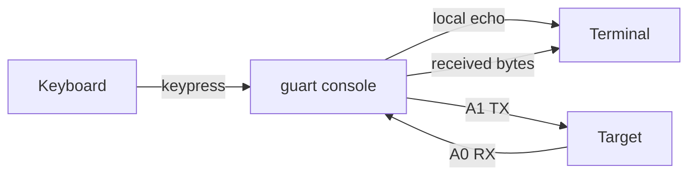

# guart

`guart` is a native UART tool for Glasgow Digital Interface Explorer revC devices. It discovers attached devices, programs an embedded fixed-function UART gateware image, and provides interactive console and byte-transparent stream modes.

Runtime use is self-contained: Python and the Glasgow software stack are only needed while building the embedded gateware resources.

## Electrical interface

The fixed revC pin assignment is:

| Glasgow pin | Direction | Connect to target |
| --- | --- | --- |
| A0 | RX input | TX output |
| A1 | TX output | RX input |
| GND | Reference | GND |

The line format is **8 data bits, no parity, 1 stop bit (8N1)** with no hardware flow control. UART I/O uses the configured Glasgow VIO voltage; verify the target voltage before connecting it.

> Disconnect USB power while wiring. Always connect grounds. Do not connect an external supply directly to Glasgow VIO.

## Build

The committed wrappers bootstrap the pinned Envy, Rust, Python, and uv toolchains. No global installation is required.

```sh
bin/envy sync
bin/b
```

Run the development binary through the repository wrapper:

```sh
bin/r guart --help
```

For a release build:

```sh
bin/b --release --locked
```

The resulting executable is `target/release/guart`.

## Device permissions on Linux

`guart` needs read/write access to the Glasgow USB device. Install an appropriate udev rule when your account cannot open it, then reconnect the device. For example:

```udev
SUBSYSTEM=="usb", ATTR{idVendor}=="20b7", MODE="0660", GROUP="plugdev", TAG+="uaccess"
```

Place the rule in `/etc/udev/rules.d/72-glasgow.rules`, reload udev, and reconnect Glasgow:

```sh
sudo udevadm control --reload-rules
sudo udevadm trigger
```

## Discover devices

Listing is passive: it does not claim, program, or otherwise change a device.

```sh
bin/r guart list
```

Machine-readable output:

```sh
bin/r guart list --json
```

When exactly one compatible Glasgow is attached, `console` and `stream` select it automatically. With multiple devices, pass the USB serial shown by `list`:

```sh
bin/r guart console --serial C3-20240903T135215Z
```

## Interactive console

Start a raw-terminal UART session at the default 115,200 bit/s:

```sh
bin/r guart console
```

Select a device and baud rate explicitly:

```sh
bin/r guart console --serial C3-20240903T135215Z --baud 1000000
```

Console behavior:

- Each keypress is transmitted immediately and echoed locally.
- Received UART bytes are written to the terminal immediately.
- Press **Ctrl-]** to drain pending TX data and exit cleanly. The escape byte is not transmitted.
- Pressing **Ctrl-\** sends byte `0x1c`; it is not an exit sequence.
- Terminal state is restored on normal exit and error paths.

If the remote target also echoes received bytes, typed characters appear twice: once from local echo and once from the target.



## Byte-transparent stream

`stream` copies stdin to UART and UART to stdout without newline or text conversion. This makes it suitable for pipes and binary data.

```sh
printf 'status\r\n' | bin/r guart stream >response.bin
```

Send a file and capture the response from a specific device:

```sh
bin/r guart stream \
  --serial C3-20240903T135215Z \
  --baud 115200 \
  --rx-idle-timeout 2s \
  --drain-timeout 5s \
  <request.bin >response.bin
```

After stdin reaches EOF, `stream` drains accepted TX bytes and waits for the configured RX quiet period. `--drain-timeout` limits how long TX completion may take. Diagnostics go to stderr, so stdout remains byte-transparent.

## Baud rates

The default is 115,200 bit/s. The requested rate must be representable by the Glasgow clock divider within the tool's 2% error limit. The accepted range is 9,600 through 12,000,000 bit/s; rates through 3,000,000 bit/s have been physically qualified by this project.

The selected actual rate is recorded in structured events.

## Structured event log

Both session modes can write newline-delimited JSON events:

```sh
bin/r guart console --event-log guart.ndjson
bin/r guart stream --event-log guart.ndjson <request.bin >response.bin
```

Events describe device selection, requested and actual baud rates, lifecycle phases, stop reasons, byte counts, and hardware error counters. Event logging never changes UART payload output.

## Command reference

```text
guart list [--json]

guart console [--serial SERIAL] [--baud BAUD]
              [--event-log PATH]

guart stream [--serial SERIAL] [--baud BAUD]
             [--event-log PATH]
             [--rx-idle-timeout DURATION]
             [--drain-timeout DURATION]
```

Use `bin/r guart <command> --help` for the authoritative option list.