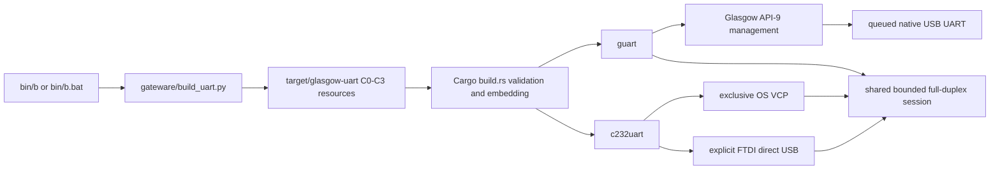

# Native UART tools

## Status and scope

This repository builds two native Rust executables:

- `guart`: fixed-profile UART on Glasgow revC hardware revisions C0 through C3.
- `c232uart`: UART on the FTDI C232HD-DDHSP-0 through either the OS VCP driver or an explicit direct-USB backend.

Linux is the runtime-validation platform. Windows and macOS are compile-and-package targets. Runtime binaries do not require Python. Python, uv, Amaranth, and the Glasgow software stack are build-time dependencies used only to generate embedded resources.

Physical qualification is complete for the selected 64 KiB quick-matrix scope through 3,000,000 bit/s. Both C232 backends pass every corpus bidirectionally at 9,600, 115,200, 1,000,000, and 3,000,000 bit/s. At 12,000,000 bit/s, C232-to-Glasgow traffic produces Glasgow framing errors on this fixture; that rate is not hardware-qualified. Release packaging follows the qualification results below.

## Architecture



The session layer owns cancellation, bounded buffering, RX/TX workers, terminal restoration, drain/idle semantics, byte counters, and NDJSON event emission. Backend code owns device selection, configuration, USB or serial transfers, hardware counters, and physical drain detection.

## Build and resource trust

Use only the repository wrappers:

```sh
bin/envy sync
bin/b
bin/b --release
```

Windows equivalents are `bin\envy.bat`, `bin\b.bat`, and `bin\r.bat`.

`bin/b` first runs `gateware/build_uart.py` under the uv-locked gateware environment, then invokes Cargo. The generator is pinned to Glasgow commit `b2a15e9c797b90167d96257a557218ddb7984e71`. Its content address covers the lockfile, project inputs, profile, supported revisions, and pinned upstream commit. Unchanged inputs reuse `target/glasgow-uart`.

The generated resources are one manifest, one FPGA bitstream, and one Cypress FX2 firmware image for each of C0, C1, C2, and C3. `build.rs` does not invoke Python. It rejects missing revisions, extra revisions, unsupported schema/profile values, and digest mismatches before embedding the resources in each executable. Runtime validation repeats the manifest and SHA-256 checks before touching a selected Glasgow.

The fixed Glasgow UART profile is:

- port A only;
- A0 is RX input and A1 is TX output;
- 3.3 V I/O rail;
- 8 data bits, no parity, 1 stop bit;
- no hardware flow control;
- one bidirectional pipe;
- 20-bit baud divisor;
- saturating 32-bit RX error and RX overflow counters;
- TX state with an idle bit and FIFO-level field.

## Command-line contract

Discover commands and all current options with `--help`:

```sh
bin/r guart --help
bin/r c232uart --help
```

Both tools expose:

- `list`: passive discovery only. It never claims a device, uploads firmware, configures an FPGA, detaches a driver, or changes device state.
- `console`: raw interactive terminal operation. Ctrl-\\ requests a clean stop; terminal state is restored on every exit path.
- `stream`: copies stdin to UART and UART to stdout without text translation.

Common defaults are 115200 bit/s, a 2 s stream timeout, and a 5 s final drain timeout. Supported requested rates are 9600 through 12,000,000 bit/s. Selection by serial is stable; ambiguous or absent selection fails instead of choosing an arbitrary device. `c232uart` defaults to `--backend vcp`; direct USB requires `--backend usb`. Backend-conflicting options are rejected.

Stable process exit codes:

| Code | Meaning |
| ---: | --- |
| 0 | Success |
| 2 | CLI or device-selection error |
| 3 | Access denied or device busy |
| 4 | Protocol or embedded-resource error |
| 5 | Timeout or cancellation |
| 6 | Validation mismatch |

Payload bytes use stdout only. Human diagnostics use stderr. `--event-log PATH` writes schema-versioned NDJSON records containing monotonic time, tool, backend, selected identity/path, requested and actual baud, phase, byte counters, hardware counters, and optional error text.

## Device ownership and transport behavior

### Glasgow

Passive discovery recognizes only normal Glasgow VID:PID `20b7:9db1`. Bare Cypress `04b4:8613` devices are reported only as recovery candidates; the tool never claims, uploads to, or mutates them automatically.

After explicit selection, `guart` validates the embedded revision resource, performs the pinned API-9 management sequence, configures the matching C0-C3 bitstream, sets the fixed electrical profile, and claims only the manifest-declared pipe interfaces and endpoints. Host RX and TX each use eight queued 32 KiB transfers. Shutdown waits for host queues, gateware FIFO state, and UART idle, then disables port-A VIO. Re-enumeration waits are bounded to 10 s and preserve serial and USB topology identity.

### C232HD VCP

VCP discovery requires VID:PID `0403:6014` and exact product `C232HD-DDHSP-0`. Linux selection correlates USB identity with `/dev/serial/by-id` and sysfs rather than accepting arbitrary tty devices. The port is opened exclusively, configured for 8N1 with flow control disabled and DTR/RTS inactive, and drained through the OS output-queue contract.

### C232HD direct USB

Direct USB is opt-in. It requires the same VID, PID, and exact product string. The backend detaches only the selected interface's kernel driver, claims it, performs FTDI reset/purge/latency/baud/line/flow/modem-control configuration, discovers endpoints from descriptors, and restores the kernel driver on every drop or error path.

RX strips each FTDI two-byte modem/status header independently for every 512-byte or short USB packet and accumulates overrun, parity, framing, and break indications. Eight 32 KiB RX requests and eight 32 KiB TX requests remain in flight. Final drain uses the FTDI TEMT state rather than host submission alone.

## Full-duplex and shutdown invariants

- RX and TX make progress independently.
- Internal buffers are bounded to 64 KiB; sustained backpressure cannot grow memory without limit.
- Interrupted, would-block, timed-out, short, and partial transfers preserve all completed bytes and retry only unfinished work.
- EOF stops new TX but continues RX until idle/drain completion.
- Cancellation stops new input, drains submitted TX within the configured bound, cancels outstanding backend work, joins both workers, emits the final event, and restores terminal/driver/device state.
- No worker thread is detached.

## External validation

`tools/lab.py` is a process-level harness. It imports no Rust internals and launches only `target/debug/guart` and `target/debug/c232uart`. It covers empty payloads, every byte value, CR/LF/NUL content, transfer-boundary crossings, sustained traffic, simultaneous independent bidirectional payloads, both C232 backends, and all requested rates.

Example after hardware setup:

```sh
bin/b
bin/uv run --project gateware --frozen python tools/lab.py \
  --guart-serial GLASGOW_SERIAL \
  --c232-serial FT61SVEW \
  --rates 9600,115200,1000000,12000000 \
  --payload-size 8388608 \
  --json-report target/lab-report.json
```

A case passes only when both subprocesses exit cleanly, opposite RX byte counts and SHA-256 digests exactly match the independent TX corpora, the reported actual rate is within 2%, and hardware error/overflow counters are zero.

## Hardware qualification

### Current fixture

- C232HD-DDHSP-0 serial: `FT61SVEW`.
- USB identity: `0403:6014`, product `C232HD-DDHSP-0`.
- Current tty: `/dev/ttyUSB0`.
- Stable VCP path: `/dev/serial/by-id/usb-FTDI_C232HD-DDHSP-0_FT61SVEW-if00-port0`.
- Current C232HD state: normal-user VCP and direct-USB open/close paths pass; direct USB restores the kernel driver and stable VCP path after exit. Both backends pass the quick matrix through 3,000,000 bit/s with zero C232 error/overflow counters.
- Current Glasgow state: normal Glasgow `20b7:9db1`, serial `C3-20240903T135215Z`, revision C3, API level 9, discovery path `003`. A 65,536-byte A1-to-A0 loopback passes exactly at requested 115,200 bit/s (actual 115,107) with zero RX errors and overflow.
- Current wiring: FTDI orange TXD to Glasgow A0, FTDI yellow RXD to Glasgow A1, and FTDI black to Glasgow ground. FTDI red and Glasgow VIO are isolated.

### Recorded quick-matrix result

The selected qualification used all five harness corpora with a 65,536-byte sustained payload rather than the default 16 MiB payload. `target/uart-lab-quick.json` is the machine-readable record. Empty, every-byte, CR/LF/NUL, 64 KiB boundary-crossing, and 64 KiB sustained cases all pass bidirectionally for VCP and direct USB at 9,600, 115,200, 1,000,000, and 3,000,000 bit/s. Startup bytes are discarded only after each receiver remains quiet for 250 ms. Glasgow holds TX idle for 100 ms before disabling port-A VIO so the peer cannot decode the rail transition as payload.

At 12,000,000 bit/s, the empty case passes, but each non-empty C232-to-Glasgow case fails with Glasgow RX framing errors and corresponding byte loss. Glasgow-to-C232 traffic remains byte-exact with zero C232 errors and overflow through both backends. This directional result, plus success at 3,000,000 bit/s through the same wiring, identifies a fixture/electrical limit rather than a hidden software pass. The harness preserves the failed cases and counters; it does not suppress or reclassify them.

### Bounded Glasgow enumeration

Keep every flying lead disconnected. Observe the power and FX2 LEDs. Replace the current hub path with one known-good data cable connected directly to a host port, wait 10 s, and inspect USB/kernel attach events. Change one variable per trial: cable, then host port, then another host if available.

Classify `20b7:9db1` as normal Glasgow. Classify `04b4:8613` only as a Cypress recovery candidate and stop for a deliberate official recovery procedure. If bounded substitutions produce no attach event, record LEDs, cable, port, host, and kernel-log evidence and stop. Do not rewrite EEPROM, use boot jumpers, inject voltage, or attempt native firmware recovery.

After normal enumeration, record the serial and exact revC stepping. Use the matching board manual and connector pin-1 marking. For a standard revC3 port-A connector, the authoritative nets are A0/IO0 on pin 3 (official orange loom), GND on pin 4 or 6 (official black loom), and A1/IO1 on pin 5 (official green loom). Never apply revC3 pin numbers or infer connector orientation on an unidentified or modified board.

### Linux local-access rules

Install these rules deliberately as `/etc/udev/rules.d/69-glasgow-tool.rules`; the filename must sort before systemd's `73-seat-late.rules`, which applies the `uaccess` tag. A `99-*` filename tags the device too late to grant the active session ACL. The binaries never install permissions:

```udev
SUBSYSTEM=="usb", ATTR{idVendor}=="20b7", ATTR{idProduct}=="9db1", TAG+="uaccess"
SUBSYSTEM=="usb", ATTR{idVendor}=="0403", ATTR{idProduct}=="6014", TAG+="uaccess"
SUBSYSTEM=="tty", ATTRS{idVendor}=="0403", ATTRS{idProduct}=="6014", TAG+="uaccess"
```

Reload rules and replug, or deliberately retrigger only these fixtures, during intentional setup. Confirm the resulting device-node ACL explicitly. Do not grant generic Cypress `04b4:8613` access, and do not infer access from group membership or enumeration alone.

### Endpoint qualification

Qualify each endpoint before cross-wiring:

1. FTDI loopback: connect FTDI orange TXD to FTDI yellow RXD, isolate every other colored lead, validate both VCP and direct-USB backends, then remove the loop.
2. Glasgow loopback: configure port A at 3.3 V, connect A1 TX to A0 RX, validate, disable VIO and the applet, then remove the loop.

### Cross-device wiring

Make or change connections only while both USB cables are unplugged.

| C232HD-DDHSP-0 lead | FTDI signal | Glasgow port-A net | Standard revC3 connector / official loom |
| --- | --- | --- | --- |
| **Orange** | TXD output | **A0 / IO0**, Glasgow RX | **Pin 3 / orange loom** |
| **Yellow** | RXD input | **A1 / IO1**, Glasgow TX | **Pin 5 / green loom** |
| **Black** | GND | **GND** | **Pin 4 or 6 / black loom** |
| **Red** | +3.3 V output | **No connection** | Insulate individually |
| Green | RTS output | **No connection** | Insulate individually |
| Brown | CTS input | **No connection** | Insulate individually |
| Grey | DTR output | **No connection** | Insulate individually |
| Purple | DSR input | **No connection** | Insulate individually |
| White | DCD input | **No connection** | Insulate individually |
| Blue | RI input | **No connection** | Insulate individually |

With the official Glasgow loom: FTDI orange to Glasgow orange, FTDI yellow to Glasgow green, and FTDI black to one Glasgow black ground wire. This crossing is intentional: each transmitter reaches the other receiver.

Leave Glasgow pin 1 SENSE, pin 2 VIO, every unused A signal, and all of port B physically unconnected. Glasgow configures its own port-A rail to 3.3 V; never join that rail to the FTDI red lead. Connect ground first, then orange-to-A0, then yellow-to-A1. Check continuity and confirm no red/VIO connection before reconnecting USB. Unplug both USB cables before later rewiring. Do not otherwise color-match the looms: FTDI green is RTS, while Glasgow green is A1.

## Release qualification

Run, in order:

1. Rust protocol/session/resource tests.
2. Gateware resource tests.
3. `guart list --json` and `c232uart list --json` without elevated privileges.
4. FTDI VCP loopback.
5. FTDI direct-USB loopback and post-run driver restoration.
6. Glasgow loopback.
7. Cross-device `tools/lab.py` matrix.
8. Linux release build and package smoke test in an environment without Python.
9. Native Windows and macOS compile/package CI jobs.

Only artifacts produced after all applicable hardware checks pass are hardware-qualified. Each per-tool archive contains one executable and `THIRD_PARTY_NOTICES.txt`; `SHA256SUMS` authenticates the archives.